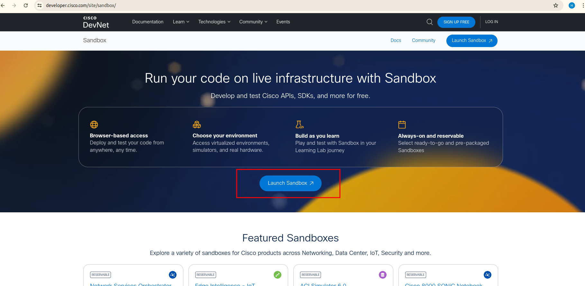
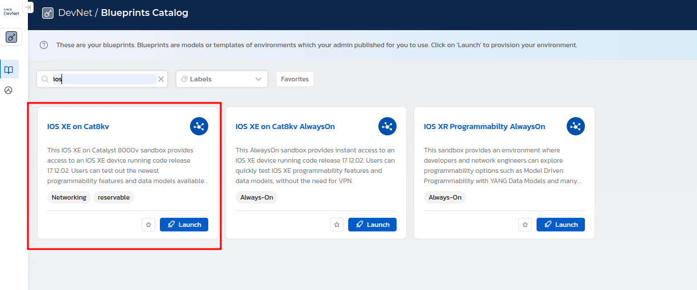
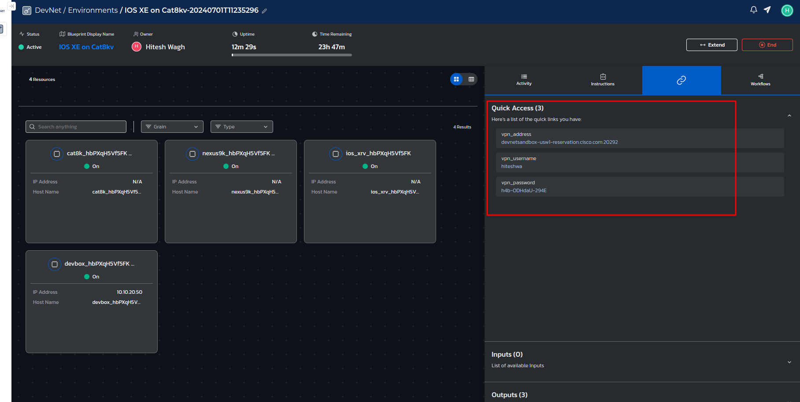
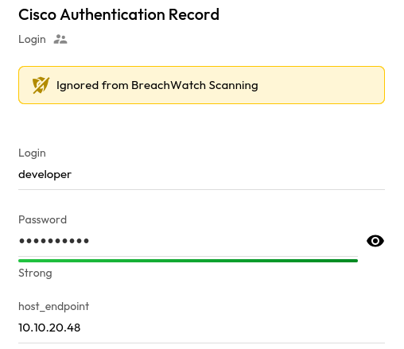
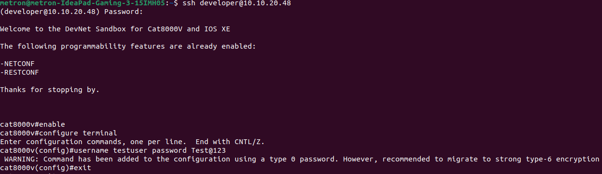
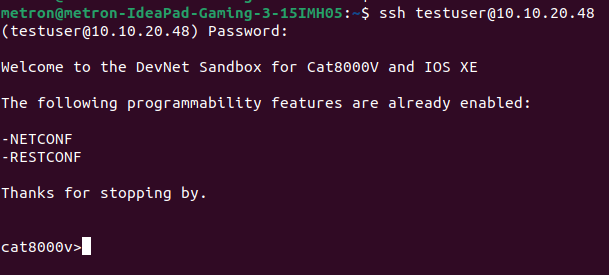

# User Guide | Keeper Security / Cisco 

## Overview

This user guide covers the post-rotation script for the Keeper Security / Cisco integration. Details on how to use the post-rotation script are available at the [_Keeper Security online documentation_](https://docs.keeper.io/en/v/secrets-manager/secrets-manager/password-rotation/post-rotation-scripts) and will not be repeated here.

## Pre-requisites

In order to use the post-rotation script, you will need the following prerequisites:

**1. Requests Library:** Ensure that the requests library is installed in your Python environment. This library is necessary for making HTTP requests to Cisco devices.

### Requests library installation   

The Requests library allows you to send HTTP requests easily. Activate a Python virtual environment in your Keeper Gateway environment and install the library using the following command:

    pip install requests

**2. Setting up AnyConnect Cisco VPN:** Ensure that the machine hosting Keeper Gateway has Cisco AnyConnect VPN installed and properly configured inorder to connect to cisco device. This setup is necessary for establishing secure connections to Cisco devices.

## Steps to Test Cisco Device

### 1. Login to Cisco Sandbox

- Go to the [Cisco DevNet Sandbox](https://devnetsandbox.cisco.com/)
- Log in with your Cisco account credentials.
- Select and launch the sandbox.



### 2. Select and Launch the Device

- Navigate to the sandbox catalog.
- Select the appropriate sandbox for your Cisco device (e.g., Cisco IOS XE, etc.).
- Launch the sandbox.



### 3. Receive Details via Email or DevNet Environment

After launching the sandbox, you will receive an email with the connection details or find them in the DevNet Environment under Quick Access.



### 4. Download Cisco AnyConnect VPN

- Download and install the Cisco AnyConnect Secure Mobility Client.
- Get detailed connection instructions [here](https://developer.cisco.com/docs/sandbox/getting-started/#support).

### 5. Connect to the VPN

- Open the Cisco AnyConnect Secure Mobility Client.
- Enter the VPN connection details provided in the email or from the DevNet Environment.
- Connect using the provided username and password.

### 6. Store Developer Credentials

At this point, you will see Developer Credentials—a host, username, and password. Store these values in a Keeper Security record of type `Login` named as `Cisco Authentication Record`. You will need this Keeper Security record name in order to run the post-rotation script.

### 7. Add Custom Field to Cisco Authentication Record

Add a custom field named `host_endpoint` to the Cisco Authentication Record and set its value to the host address (e.g., `10.10.20.48`).



### 8. Create a User

- Open your terminal or SSH client.
- Connect to the Cisco device using the provided IP address and credentials.

### 9. Follow These Steps to Create a User

1. Login with Admin User (developer):

    ```sh
    ssh developer@<device-ip>
    ```

2. Enable privileged commands:

    ```sh
    enable
    ```

3. Enter configuration mode:

    ```sh
    configure terminal
    ```

4. Create a new user with a password:

    ```sh
    username <user> password <pass>
    ```



### 10. Test the New User

Login with the new user:

```sh
ssh <user>@<device-ip>
```



> **Note:** Replace `<user>` with the username you created and `<device-ip>` with the IP address of the Cisco device.

Following these steps will allow you to test the Cisco device and create a new user in the Cisco sandbox environment.

> **Note:** If you want to use a virtual environment, add a shebang line at the top of the script as documented here in the [Python Environment Setup](https://docs.keeper.io/en/v/secrets-manager/secrets-manager/password-rotation/post-rotation-scripts/use-case-examples/rotate-credential-via-rest-api#step-5-python-environment-setup).

## Using the Script

Once you have your prerequisites ready, make sure you cover the following:

1. Ensure that the post-rotation script references the Keeper Security record containing your Cisco admin credentials.
2. Attach the post-rotation script to a Keeper Security PAM user record using the Keeper Security documentation. When this record has its secrets rotated, the post-rotation script will execute and update the password for the specified Cisco device user.

This guide provides essential information for integrating Keeper Security with Cisco devices, enabling automated password rotation and ensuring secure management of credentials.