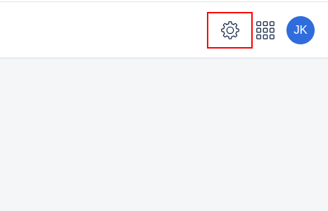
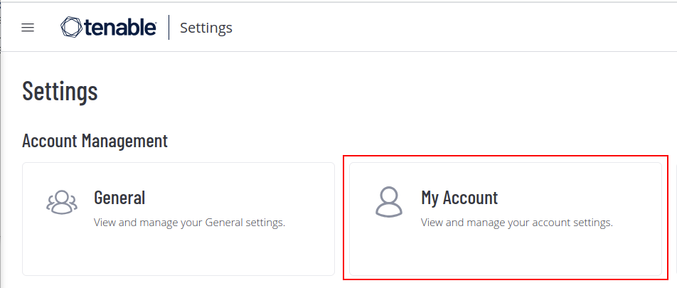
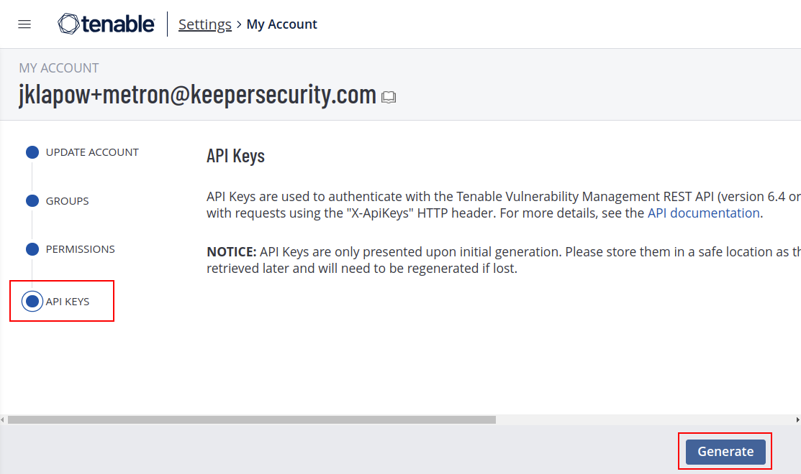
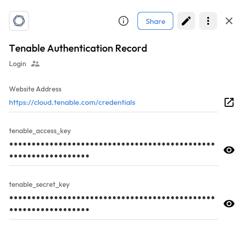

# User Guide | Keeper Security / Tenable 

## Overview

This user guide covers the post-rotation script for the Keeper Security / Tenable.io (Cloud) integration. Details on how to use the post-rotation script are available at the [_Keeper Security online documentation_](https://docs.keeper.io/en/v/secrets-manager/secrets-manager/password-rotation/post-rotation-scripts) and will not be repeated here.

## Pre-requisites

In order to use the post-rotation script, you will need the following prerequisites:

**1. Tenable API keys:** An access key and secret key pair is needed to authenticate with the Tenable API.

**2. Tenable Credential Types:** Tenable has the ability to store multiple types of credentials. The exact JSON object for the credential settings will change depending on the type of credential.

**3. pyTenable Library:** Ensure that the pyTenable library is installed in your python environment.

### Step 1: Tenable API Key

To generate the Tenable API key, you will need a Tenable user with permissions to create API Keys. Once you have that:

1. Log in to your Tenable account and click on the settings icon in the top right

    

2. Click on the My Account button

    

3. Click on API Keys and then Generate to generate API keys

    
   
4. At this point you will see two keys generated - An Access Key and a Secret Key. Store both these values in a Keeper Security record. You will need this Keeper Security record name in order to run the post-rotation script.

    

### Step 2: Tenable Credential Types

Tenable has the ability to store multiple types of credentials. For example, you can save Windows login credentials or Amazon AWS access credentials. The exact JSON object for the credential settings will change depending on the type of credential. For example, a credential of type Windows would look like:

```json
{
    "type": "Windows",
    "settings": {
        "domain": "",
        "username": "user@example.com",
        "auth_method": "Password",
        "password": "****"
    }
}
```

while a credential of type Amazon AWS would look like:
```json
{
    "type": "Amazon AWS",
    "settings": {
        "access_key_id": "****",
        "secret_key": "****",
    }
}
```

The post-rotation script contains a function get\_updated\_settings which is responsible for taking an existing settings object (shown in the “settings” key in the examples above) and returning a new settings object with updated credentials. The post-rotation script shows an example for Windows, but this can be adapted to whichever credential type you want to rotate.

### Step 3: pyTenable Installation

pyTenable is intended to be a pythonic interface into the Tenable application APIs. You should have pyTenable library installed in your python environment to successfully run the post-rotation script. To install pyTenable, activate a Python virtual environment in your keeper-gateway environment and then run

    pip install pytenable


#### NOTE: If you want to use a virtual environment, add a shebang line at the top of the script as documented here [_Python Environment Setup_](https://docs.keeper.io/en/v/secrets-manager/secrets-manager/password-rotation/post-rotation-scripts/use-case-examples/rotate-credential-via-rest-api#step-5-python-environment-setup)

## Using the script

Once you have your pre-requisites ready, modify the post-rotation script to make sure you cover the following:

1. Ensure that the post-rotation script references the Keeper Security record containing your Tenable API credentials.

2. In the python script, ensure that you are updating the correct field in the line “tio.credentials.edit(...)”

Once this is done, attach the post-rotation script to a Keeper Security PAM user record using the Keeper Security [_documentation_](https://docs.keeper.io/en/v/secrets-manager/secrets-manager/password-rotation/post-rotation-scripts). When this record has its secrets rotated, the post-rotation script will run and update the secret in Tenable.
