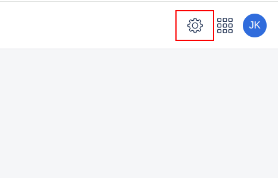
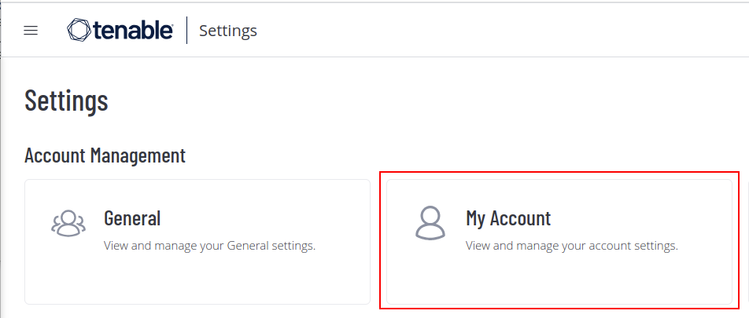
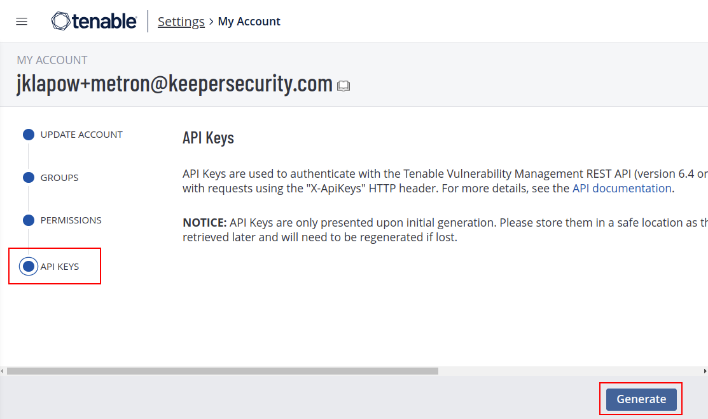
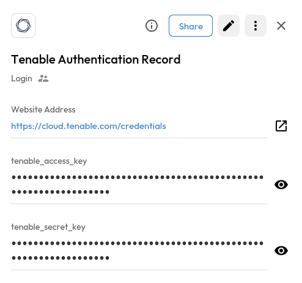

# User Guide | Keeper Security / Tenable 

## Overview

This user guide covers the post-rotation script for the Keeper Security / Tenable.io (Cloud) integration. Details on how to use the post-rotation script are available at the [_Keeper Security online documentation_](https://docs.keeper.io/en/v/secrets-manager/secrets-manager/password-rotation/post-rotation-scripts) and will not be repeated here.

## Pre-requisites

In order to use the post-rotation script, you will need the following prerequisites:

**1. Tenable API keys:** An access key and secret key pair is needed to authenticate with the Tenable API.

**2. pyTenable Library:** Ensure that the pyTenable library is installed in your python environment.

### Step 1: Tenable API Key

To generate the Tenable API key, you will need a Tenable user with permissions to create API Keys. Once you have that:

1. Log in to your Tenable account and click on the settings icon in the top right

    

2. Click on the My Account button

    

3. Click on API Keys and then Generate to generate API keys

    
   
4. At this point you will see two keys generated - An Access Key and a Secret Key. Store both these values in a Keeper Security record. You will need this Keeper Security record name in order to run the post-rotation script.

    

### Step 2: pyTenable Installation

pyTenable is intended to be a pythonic interface into the Tenable application APIs. You should have pyTenable library installed in your python environment to successfully run the post-rotation script. To install pyTenable, activate a Python virtual environment in your keeper-gateway environment and then run

    pip install pytenable

#### NOTE: If you want to use a virtual environment, add a shebang line at the top of the script as documented here [_Python Environment Setup_](https://docs.keeper.io/en/v/secrets-manager/secrets-manager/password-rotation/post-rotation-scripts/use-case-examples/rotate-credential-via-rest-api#step-5-python-environment-setup)

## Using the script

Once you have your pre-requisites ready, modify the post-rotation script to make sure you cover the following:

1. Ensure that the post-rotation script references the Keeper Security record containing your Tenable API credentials.

2. In the python script, ensure that you are updating the password field in the line “tio.users.change_password(...)”

Once this is done, attach the post-rotation script to a Keeper Security PAM user record using the Keeper Security [_documentation_](https://docs.keeper.io/en/v/secrets-manager/secrets-manager/password-rotation/post-rotation-scripts). When this record has its secrets rotated, the post-rotation script will run and update the secret in Tenable.